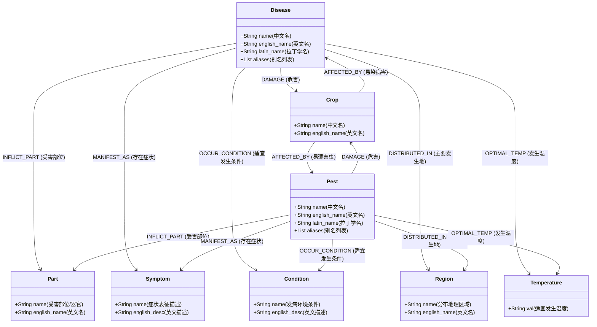

# 农作物病虫害知识图谱（CropDP-KG）构建方案与实施技术文档

本项目基于农业病虫害领域数据，构建覆盖“病原/害虫-寄主作物-受害部位-表征症状-环境诱因-分布地区-适宜温度”的高质量农作物病虫害知识图谱（CropDP-KG），依托图数据库（Neo4j）提供结构化关联存储、多跳诊断推理与图谱可视化支撑。

---

## 一、 数据集全景与特征

### 1.1 数据清单
数据源位于 `Dataset/` 目录，包含 8 个核心文件：
1. `relationcrop.csv` (3,870 条)：病虫害与寄主作物的危害关系，包含拉丁学名及作物中英文名。
2. `relationsym.csv` (10,549 条)：病虫害所呈现的典型症状描述（中英文）。
3. `relationcon.csv` (2,033 条)：病虫害发病或流行的适宜环境条件与诱因。
4. `relationarea.csv` (1,562 条)：病虫害主要分布省区及地理大区。
5. `relationpart.csv` (1,321 条)：病虫害侵染危害的植株器官与部位。
6. `relationtem.csv` (90 条)：病虫害发病的关键温度指标。
7. `relationEng.csv` (2,536 条)：中英文病虫害实体名称映射及英文别名。
8. `named entity.csv` (1,001 条)：标注有实体边界（offset）与类型的半结构化语料库（涵盖 Disease, Pest, Crops, Symptom, Condition, Part, Area, English 等）。

### 1.2 关键工程处理点
- **编码自适应**：`relationcrop.csv` 与 `named entity.csv` 使用 UTF-8 / UTF-8-BOM；其余关系表使用 GB18030 编码。构建程序需自适应统一解码。
- **头实体类型推断**：通过金标准标注库白名单（`named entity.csv`）与农学后缀规则引擎（病/枯/腐/霉/斑 $\rightarrow$ 病害；蛾/蚜/象甲/蚧/蝶/螨 $\rightarrow$ 害虫），精确区分 `:Disease` 与 `:Pest` 标签。
- **实体去重与属性融合**：基于实体名称（`name`）进行节点归一，自动聚合拉丁学名（`latin_name`）、英文名称（`english_name`）与多别名列表（`aliases`）。

---

## 二、 概念模型（Ontology Schema）



---

## 三、 图数据库设计与存储策略

### 3.1 数据库选型
采用 **Neo4j 5.x+**，默认存储于本地 `nongww` 数据库中。

### 3.2 唯一性约束与索引
为防止节点重复插入并保证毫秒级查询，预先建立约束与索引：
```cypher
CREATE CONSTRAINT IF NOT EXISTS FOR (d:Disease) REQUIRE d.name IS UNIQUE;
CREATE CONSTRAINT IF NOT EXISTS FOR (p:Pest) REQUIRE p.name IS UNIQUE;
CREATE CONSTRAINT IF NOT EXISTS FOR (c:Crop) REQUIRE c.name IS UNIQUE;
CREATE CONSTRAINT IF NOT EXISTS FOR (s:Symptom) REQUIRE s.name IS UNIQUE;
CREATE CONSTRAINT IF NOT EXISTS FOR (pt:Part) REQUIRE pt.name IS UNIQUE;
CREATE CONSTRAINT IF NOT EXISTS FOR (cd:Condition) REQUIRE cd.name IS UNIQUE;
CREATE CONSTRAINT IF NOT EXISTS FOR (r:Region) REQUIRE r.name IS UNIQUE;
CREATE CONSTRAINT IF NOT EXISTS FOR (t:Temperature) REQUIRE t.val IS UNIQUE;
```

### 3.3 批量导入机制
使用 Python `neo4j` 官方驱动，利用参数化批量 Cypher（`UNWIND $batch AS row ... MERGE ...`），每批 500~1000 条，兼具极高的导入效率与事务幂等性。

---

## 四、 图谱应用与功能扩展

1. **多跳路径辅助诊断**：给定农作物（如“桃”）+ 受害部位（如“果实”）+ 观察到的症状（如“凹陷病斑”），通过图谱交叉路径查询可推测最高概率的病虫害及对应发生环境。
2. **前后端接口（Django + Vue）**：
   - `/api/graph/search/`：全局实体搜索与邻域子图展开。
   - `/api/graph/diagnose/`：根据作物与症状组合智能推荐病害诊断结果。
   - 前端集成 ECharts Graph / Cytoscape 力导向图，呈现交互式网络。
